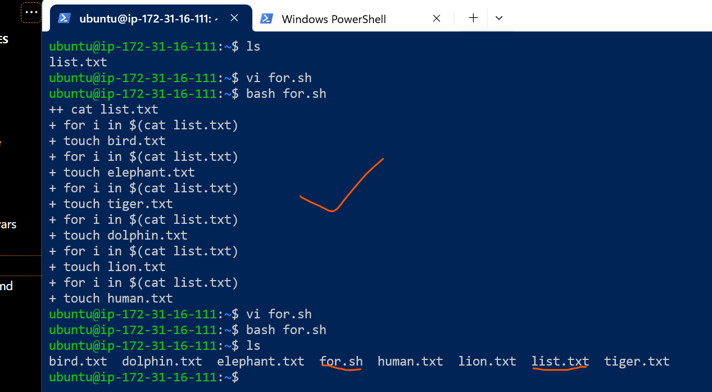

Copy this into list.txt:
```
bird
elephant
tiger
dolphin
lion
human
```


### 1. Print the last 2 lines from the file


### 2. Print the list sorted

### 3. Using "for" statement create an empty .TXT file for each line, for example bird.txt
* find the below script.`for.sh`.
```sh
#!/bin/sh
set -x
for i in $(cat list.txt); do
  touch "${i}.txt"
done
```
* `output`:



### 4. Run: "sh i-dont-exist.sh". Print the return code from that statement.
* sample script vi `test.sh`.
```sh
#!/bin/sh
sh i-dont-exist.sh
echo $?
```
* `output`:


## scripting tasks completed.

# `Thank You`

## mauricio.wyler@lendistry.com
